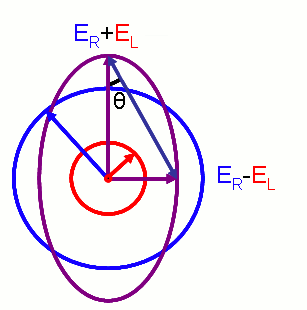
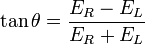
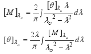

Circular dichroism leads to the transformation of plane polarized light into elliptically polarized light, and is directly related to differential absorbance of LEft Circularly Polarised (LCP) and Right Circularly Polarised (RCP) components of plane polarized light, by chiral substances which also absorb light. The plot of the variation in the ellipticity, of the elliptically polarized light, as a function of wavelength, gives us the CD spectrum. In order to understand circular dichroism, and its role in CD spectroscopy, we need to visit some definitions and concepts.  

**CD spectroscopy - Concepts, measurable parameters and quantitative relationships**  

As we have discussed CD is the direct consequence of differential absorbance. So studying variation of differential absorbance with variation in wavelength is a good approach. We define delta absorbance, a parameter to study CD, as
&#163;GA=AL-AR  
where AL and AR represents the absorbance of LCP light and RCP light respectively.  

Though the the difference in absorption to be measured is very small (usually a few 1/100ths to a few 1/10th of a percent), but it can be determined quite accurately.  

A circular dichroism signal can be positive or negative, depending on whether left circularly polarised light is absorbed to a greater extent than right circularly polarised light (CD signal positive) or to a lesser extent (CD signal negative). An example CD spectrum of a sample with multiple CD peaks is shown below, demonstrating how CD varies as a function of wavelength, and that a CD spectrum may exhibit both positive and negative peaks.  

As discussed above, from Beer-Lambert law we can express delta absorbance as  
&#163;GA= (&#163;`L - &#163;`R)Cl    
where, C is the molar concentration, and l is the path length in centimetres(cm).  
Therefore we can plot the difference in molar extinction coefficient of LCP and RCP light &#163;G&#163;`= &#163;`L - &#163;`R as a function of wavelength. Thus we have an intrinsic property called molar circular dichroism, &#163;G&#163;` to represent CD spectroscopy.  

Upto now we have seen CD as an intrinsic property of the molecule but in many practical applications of circular dichroism (CD), the measured CD may also be a function of temperature, concentration, and the chemical environment, including solvents. So in those cases we should follow another way to represent CD spectra. To do that instead of looking at the cause of circular dichroism (differential absorbance) we may look at the effect of CD (ellipticity).  

Hence we define ellipticity of polarization as the inverse tangent of the quotient of the minor and major axes of the elliptically polarised wave. And it is derived as,  

     

source:[http://en.wikipedia.org/wiki/File:Electric_Vectors_1.png](http://en.wikipedia.org/wiki/File:Electric_Vectors_1.png) 	 

where  
ER and EL are the magnitudes of the electric field vectors of the right-circularly and left-circularly polarized light, respectively.  

This ellipticity will depend on the path length and concentration of medium. So we can think of specific ellipticity, ellipticity per unit length per unit concentration.We can think of an intrinsic property in terms of this ellipticity, molar ellipticity ([&#163;c]), which is simply the product of molecular weight of the molecule and specific ellipticity.  
**[&#163;c] = M x specific ellipticity x 10-2**  

Now the Molar circular dichroism, &#163;G&#163;`, and molar ellipticity, [&#163;c], are readily interconvertable by the equation:  
**[&#163;c] = 3298.2 &#163;`**  
   
After having discussed different measurable parameters related to CD spectra lets have a look at how it is measured in practical situations.  

Circular dichroism spectra are measured using a CD spectrometer which is a highly specialised derivative of an ordinary absorption spectrometer. CD spectrometers measure alternately the absorption of left and right circularly polarised lights, usually at a frequency of 50 kHz, and then calculate the CD signal. CD is reported either in units of &#163;GA, the delta absorbance (is discussed below), or in degrees ellipticity. [&#163;c], the molar ellipticity in deg cm2 dmol¡V1 = 3298.2 &#163;_A which is also discussed in detail below.  
**Note:** One should be very careful with the concentration of the sample taken. There is a misconception that more the concentration, better the CD signal which is totally incorrect. However, in reality, the reverse happens. If the concentration is more, less light will pass through it and it will give the CD signal with error. Therefore, an optimal concentration of the sample should be chosen to obtain an error-free CD signal.  

**CD vs ORD : their interrelation and preference of CD over ORD**  

We have seen Circular dichroism as an absorptive effect and ORD as a dispersive effect of interaction between an EM wave and an anisotropic medium. We also have discussed the measuring parameters of ORD and CD. In case of ORD the molecular rotation [M]T&#163;f and in case of CD the molar ellipticity [&#163;c]T&#163;f are the most important parameters. They are also interrelated by Kroning-Kramer transformation as shown below.  

  

So we can easily switch between CD and ORD data. One must keep in mind that ORD is observed in any molecule which is chiral but CD is observed only when there is a chromophore. So when CD is observed a cotton effect must be present there.  

But in practical purpose we prefer CD data over ORD data. There are several reasons behind doing that  
    
   - In ORD if several cotton effects are present then it is difficult to estimate their magnitude, sign and wavelength. In CD spectra it is much easier to interpret. There exists an one to one correspondence between absorption peaks and CD signals.   
   - CD spectra has a better sensitivity.  
   - Since CD spectra is not spread over a wide range like ORD spectra, it has a better resolution.  

**Goal of The Experiment**  

In this experiment we have two samples. They are enantiomers of each other. We will learn to determine which one is R and which one is S enantiomer. After that we will measure the ORD and CD spectrum of both the samples. Once we get all the spectrum we will try to match the ORD curve of a smaple to its own CD graph.  
